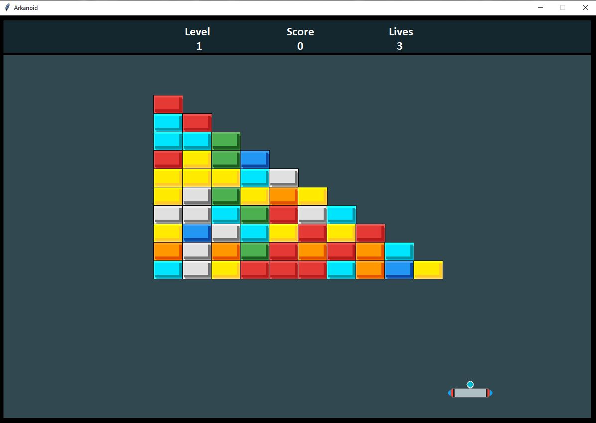

# Arkanoid
A simplistic version of a classic Arkanoid game written in Python3, for Linux and Windows environments.

# More levels
You can add more levels by editing levels/levels.json file.
Add "levelN" ("level4", "level5", ...) key, and the value has to be the 18x12 matrix, where "b" - represents the block, and "" (empty string) - represents empty space.

# How to play
Copy all files to any directory. Make sure you have <b>PIL</b> Python module. In a shell or cmd run:

```shell
python arkanoid.py
```

## Screenshots


## Made by
[Eugeny Khanchin](https://github.com/eKhanchin)
